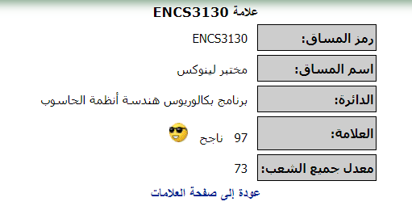

<h1 align="center">Linux Laboratory (ENCS3130 )</h1>

***
  
# Course Description
Fundamental concepts about UNIX and Linux. File system, Process Control, System Administration. Editors, shells and debuggers. Shell scripting. Graphics and advanced topics.

## ENCS3130 Projects
* Shell-Script 
* Python 

## Partners 
* [Qutaiba Olayyan](https://github.com/SwAt1563)
* [Kareem Afaneh](https://github.com/KareemAfaneh)

## My Score 😎 

 
